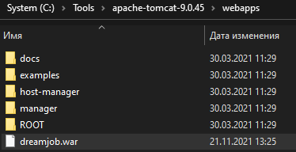
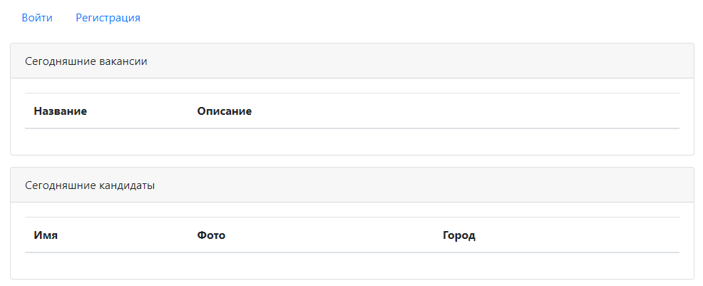

# Проект - Dream job

## О проекте

* Приложение представляет собой биржу труда с web-интерфейсом:
   
* Пользователь может быть как кандидатом так и HR. Кандидаты могут вносить в систему данные о себе:
   
* HR могут публиковать вакансии о работе:
   
* Проект построен на сервлетах и JSP. Есть 2 слоя: слой контроллеров и слой по работе с БД PostgreSQL 
(реализован на JDBC, также есть возможность хранить данные в памяти с помощью класса MemStore).
* В проекте используется шаблон MVC. Все виды открываются через GET-методы сервлетов, 
что позволяет отправлять необходимые данные на виды, представленные JSP-страницами.
* Для реализации логики отображения на JSP-страницах используются Scriplets и JSTL.
* JSP-страницы реализованы на HTML и Bootstrap.
* Реализована возможность добавления фото для кандидата, которое после добавления можно также скачать:
   
* Только авторизованные пользователи могут просматривать списки вакансий и кандидатов,
  а также добавлять новые. Авторизация построена на основе фильтра (класс AuthFilter)
  и сервлета, выполняющего проверку пароля на соответствие данным из БД (класс AuthServlet). Все зарегистрированные пользователи
  хранятся в БД. Форма авторизации:
   
* Есть возможность регистрации новых пользователей, которая реализуется сервлетом RegServlet. Форма регистрации:
   
* В качестве системы логирования используется связка log4j и slf4j.
* Для работы с JSON-форматом используется библиотека GSON.
* Для отображения авторизованного пользователя на всех страницах используется объект Session.
* С помощью JS и JQuery сделана валидация всех форм приложения:
   
* Для отображения списка городов на странице добавления и редактирования кандидатов используется технология AJAX
  (посылается AJAX-запрос с помощью JQuery на сервлет CityServlet):
  
 
## Сборка

Для сборки проекта необходимо:
1. Установить JDK 14.
2. Установить Maven.
3. Установить сервер БД PostgreSQL, задать логин - *postgres*, пароль - *password*.
4. Установить Tomcat.
5. Скачать исходный код проекта.
6. Перейти в корень проекта, где лежит файл `pom.xml`.
7. Собрать проект командой `mvn -DskipTests=true package`.
   При успешной сборке должна появиться папка target c `dreamjob-2.war`.
8. Переименовать war-архив в `dreamjob.war`.
9. Создать в pg_Admin БД *dreamjob*.
10. Открыть Query Tool для созданной БД и запустить SQL-скрипт `schema.sql`,
    находящийся в папке `db`:
     
11. Скопировать `dreamjob.war` в папку `webapps` Tomcat:  
     
12. Скопировать файл `db.properties` в папку `bin` Tomcat:  
     
13. Запустить сервер с помощью `startup.bat` из папки `bin` Tomcat.

## Использование

Переходим на главную [страницу](http://localhost:8080/dreamjob/) приложения:

Регистрируемся:

Авторизуемся:

Добавим вакансию:

Отредактируем добавленную вакансию:

Добавим кандидата:

Добавим фото:

Проверим, что информация на главной странице обновилась:

## Контакты
